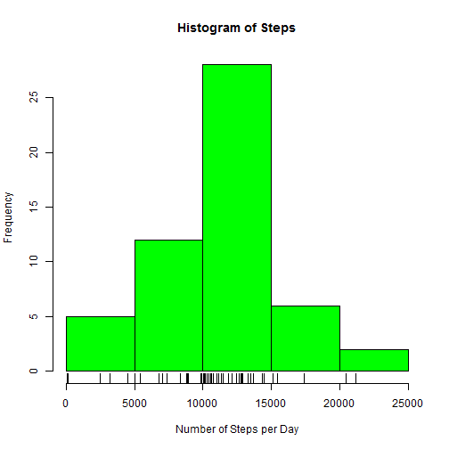
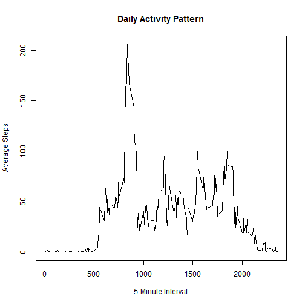
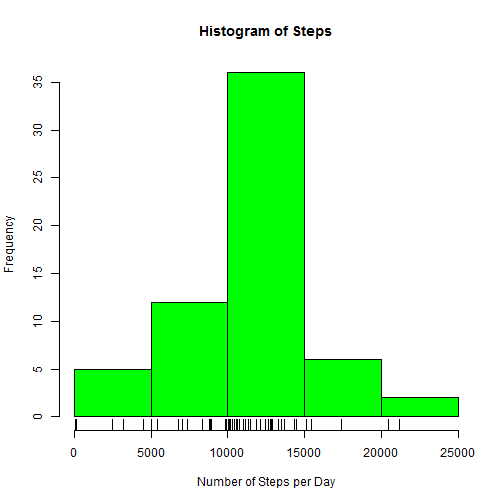
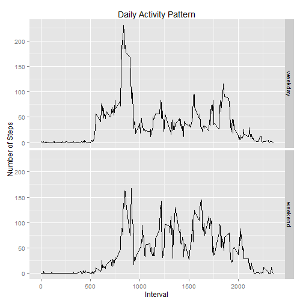

#Reproducible Research - Peer Assessment1
Suresh B. Cherukuri

This assignment is part of Coursera's 'Reproducible Research' course and makes use of data from a personal activity monitoring device.  The data (number of steps taken) is collected from an anonymous individual over a period of two months at 5 minute intervals. 

### Loading and preprocessing the data

```r
proj_url<-"https://d396qusza40orc.cloudfront.net/repdata%2Fdata%2Factivity.zip"
download.file(proj_url,"data.zip")
unzip("data.zip")
dat<-read.csv("activity.csv")
```

### What is total number of steps taken per day?
For this part of the assignment, missing values in the dataset are ignored. First, we will calculate the total number of steps taken per day and make a histogram of that data.


```r
stepsPerDay<-aggregate(steps~date,dat,sum)
hist(stepsPerDay$steps,main="Histogram of Steps",
     xlab="Number of Steps per Day",col="green")
rug(stepsPerDay$steps)
```

 

```r
stepsmean<-mean(stepsPerDay$steps)
stepsmedian<-median(stepsPerDay$steps)
```
The mean total number of steps taken per day is 10766. The median is 10765.

### What is the average daily activity pattern?
A time series plot of the 5-minute interval on x-axis and the average number of steps taken, averaged across all days is made to illustrate the daily activity pattern.


```r
averagesteps<-aggregate(steps~interval,dat,mean)
with(averagesteps,
plot(interval,steps,type="l",
     main="Daily Activity Pattern",
     xlab="5-Minute Interval",ylab = "Average Steps"))
```

 

```r
peak<-averagesteps[which(averagesteps$steps ==max(averagesteps$steps)),]
```

The line graph indicates that the maximum number of steps, 206, are taken at 5-minute interval of 835.

### Imputing missing Values
The activity dataset contains some missing values which may affect some calculations and summaries of the data. We will first calculate and report total number of missing values.


```r
countNAs<-sum(!complete.cases(dat))
```
The total number of rows with missing values (NA s) is 2304.

Since these missing values affect summaries, we will create a new dataset that is equal to original dataset and fill in missing values. The strategy to fill in the values is essentially averaging the steps for the same 5-minute interval.


```r
dat2<-dat
for (i in 1:nrow(dat2)){

  if(is.na(dat2[i,"steps"])){
    dat2[i,"steps"]<-mean(subset(dat,interval==dat[i,"interval"])$steps,na.rm = TRUE)}
}
```

We will now creaet a histogram of the total number of steps taken each day using the new dataset created. We will also estimate mean and median for the total number of steps.

```r
stepsPerDay_dat2<-aggregate(steps~date,dat2,sum)
hist(stepsPerDay_dat2$steps,main="Histogram of Steps",
     xlab="Number of Steps per Day",col="green")
rug(stepsPerDay_dat2$steps)
```

 

```r
stepsmean2<-mean(stepsPerDay_dat2$steps)
stepsmedian2<-median(stepsPerDay_dat2$steps)
```
When compared to original histogram, the revised dataset results in higher frequency in the middle (larger number of observations) which is due to filling in the missing values with average values.

The mean total number of steps taken per day is 10766. The median is 10766. The estimates of the total daily number of steps remained very similar because we replaced all missing values with the average values for each 5-minute interval.

### Are there differences in activity patterns between weekdays and weekends?

To observe whether there are ny differences in activity patterns between weekdays and weekends, we will create a new factor variable with levels of 'weekday' and 'weekend' in the dataset with the filled-in missing values.


```r
dat2$date<-as.Date(dat2$date)
dat2$day <- factor(weekdays(dat2$date) %in% c("Saturday","Sunday"),
labels=c("weekday","weekend"), ordered=FALSE)
averagesteps2<-aggregate(dat2$steps,by=list(interval=dat2$interval,day=dat2$day),mean)

# create plot
library(ggplot2)
g<-ggplot(averagesteps2,aes(interval,x))
p<-g+geom_line()+facet_grid(day~.)+labs(title="Daily Activity Pattern",x="Interval",y="Number of Steps")
print(p)
```

 
It appears that the activity reaches a peek in the morning on the weekdays, the activity is more uniform throughout the day on the weekends.
